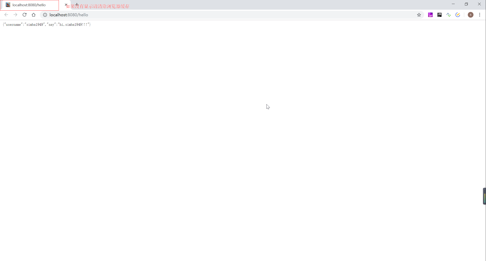

# SpringBoot 学习笔记

## 前言

spring-boot 官方文档：https://docs.spring.io/spring-boot/docs/2.2.0.BUILD-SNAPSHOT/reference/html/#boot-documentation

spring-io 官方文档：https://docs.spring.io/platform/docs/Cairo-SR7/reference/htmlsingle/#platform-documentation

## pom 多种依赖方式（maven）

### Inheriting the Starter Parent

```xml
<parent>
    <groupId>org.springframework.boot</groupId>
    <artifactId>spring-boot-starter-parent</artifactId>
    <version>2.2.0.BUILD-SNAPSHOT</version>
</parent>
```

### Using Spring Boot without the Parent POM

```xml
<dependencyManagement>
    <dependencies>
        <dependency>
            <!-- Import dependency management from Spring Boot -->
            <groupId>org.springframework.boot</groupId>
            <artifactId>spring-boot-dependencies</artifactId>
            <version>2.2.0.BUILD-SNAPSHOT</version>
            <type>pom</type>
            <scope>import</scope>
        </dependency>
    </dependencies>
</dependencyManagement>
```

### Inheriting the Platform Bom

```xml
<parent>
    <groupId>io.spring.platform</groupId>
    <artifactId>platform-bom</artifactId>
    <version>Cairo-SR7</version>
    <relativePath/>
</parent>
```

### Using Spring IO without the Parent POM

```xml
<dependencyManagement>
    <dependencies>
        <dependency>
            <groupId>io.spring.platform</groupId>
            <artifactId>platform-bom</artifactId>
            <version>Cairo-SR7</version>
            <type>pom</type>
            <scope>import</scope>
        </dependency>
    </dependencies>
</dependencyManagement>
```

## 1 基本配置

### 1.1 SpringBoot 入口类和 @SpringBootApplication

**pom.xml**

```xml
<?xml version="1.0" encoding="UTF-8"?>
<project xmlns="http://maven.apache.org/POM/4.0.0"
         xmlns:xsi="http://www.w3.org/2001/XMLSchema-instance"
         xsi:schemaLocation="http://maven.apache.org/POM/4.0.0 http://maven.apache.org/xsd/maven-4.0.0.xsd">
    <modelVersion>4.0.0</modelVersion>

    <groupId>top.simba1949</groupId>
    <artifactId>spring-boot-get-start</artifactId>
    <version>1.0-SNAPSHOT</version>

    <!-- Inherit defaults from Spring Boot -->
    <parent>
        <groupId>org.springframework.boot</groupId>
        <artifactId>spring-boot-starter-parent</artifactId>
        <version>2.1.5.RELEASE</version>
    </parent>

    <dependencies>
        <!--spring boot starter : Core starter, including auto-configuration support, logging and YAML-->
        <dependency>
            <groupId>org.springframework.boot</groupId>
            <artifactId>spring-boot-starter</artifactId>
        </dependency>
        <!--spring boot starter test : Starter for testing Spring Boot applications with libraries including JUnit, Hamcrest and Mockito-->
        <dependency>
            <groupId>org.springframework.boot</groupId>
            <artifactId>spring-boot-starter-test</artifactId>
            <scope>test</scope>
        </dependency>
        <!--spring boot starter actuator:
            Starter for using Spring Boot’s Actuator which provides production ready features to help you monitor and manage your application
        -->
        <dependency>
            <groupId>org.springframework.boot</groupId>
            <artifactId>spring-boot-starter-actuator</artifactId>
        </dependency>

        <!--spring boot starter web : Starter for building web, including RestFul, applications using Spring MVC. Uses Tomcat as the default embedded container-->
        <dependency>
            <groupId>org.springframework.boot</groupId>
            <artifactId>spring-boot-starter-web</artifactId>
        </dependency>

        <dependency>
            <groupId>org.springframework.boot</groupId>
            <artifactId>spring-boot-devtools</artifactId>
            <optional>true</optional> <!-- 表示依赖不会传递 -->
        </dependency>
    </dependencies>

    <build>
        <plugins>
            <!--编译插件-->
            <plugin>
                <groupId>org.apache.maven.plugins</groupId>
                <artifactId>maven-compiler-plugin</artifactId>
                <configuration>
                    <!-- 配置使用的 jdk 版本 -->
                    <target>1.8</target>
                    <source>1.8</source>
                </configuration>
            </plugin>
            <!--springboot-maven打包插件-->
            <plugin>
                <groupId>org.springframework.boot</groupId>
                <artifactId>spring-boot-maven-plugin</artifactId>
            </plugin>
            <!--资源拷贝插件-->
            <plugin>
                <groupId>org.apache.maven.plugins</groupId>
                <artifactId>maven-resources-plugin</artifactId>
                <configuration>
                    <encoding>UTF-8</encoding>
                </configuration>
            </plugin>
            <!--实现热部署插件-->
            <plugin>
                <groupId>org.springframework.boot</groupId>
                <artifactId>spring-boot-maven-plugin</artifactId>
                <configuration>
                    <fork>true</fork> <!-- 如果没有该配置，devtools不会生效 -->
                </configuration>
            </plugin>
        </plugins>
        <!--IDEA是不会编译src的java目录的xml文件，如果需要读取，则需要手动指定哪些配置文件需要读取-->
        <resources>
            <resource>
                <directory>src/main/java</directory>
                <includes>
                    <include>**/*</include>
                </includes>
            </resource>
            <resource>
                <directory>src/main/resources</directory>
                <includes>
                    <include>**/*</include>
                </includes>
            </resource>
        </resources>
    </build>
</project>
```

**启动程序**

```java
package top.simba1949;

import org.springframework.boot.SpringApplication;
import org.springframework.boot.autoconfigure.SpringBootApplication;

/**
 * @author SIMBA1949
 * @date 2019/7/7 13:23
 */
@SpringBootApplication
public class Application {
    public static void main(String[] args) {
        SpringApplication.run(Application.class, args);
    }
}
```

**@SpringBootApplication** 是 SpringBoot 的核心注解，是一个组合注解，源码如下

```java
/*
 * Copyright 2012-2019 the original author or authors.
 *
 * Licensed under the Apache License, Version 2.0 (the "License");
 * you may not use this file except in compliance with the License.
 * You may obtain a copy of the License at
 *
 *      https://www.apache.org/licenses/LICENSE-2.0
 *
 * Unless required by applicable law or agreed to in writing, software
 * distributed under the License is distributed on an "AS IS" BASIS,
 * WITHOUT WARRANTIES OR CONDITIONS OF ANY KIND, either express or implied.
 * See the License for the specific language governing permissions and
 * limitations under the License.
 */

package org.springframework.boot.autoconfigure;

import java.lang.annotation.Documented;
import java.lang.annotation.ElementType;
import java.lang.annotation.Inherited;
import java.lang.annotation.Retention;
import java.lang.annotation.RetentionPolicy;
import java.lang.annotation.Target;

import org.springframework.boot.SpringBootConfiguration;
import org.springframework.boot.context.TypeExcludeFilter;
import org.springframework.context.annotation.Bean;
import org.springframework.context.annotation.ComponentScan;
import org.springframework.context.annotation.ComponentScan.Filter;
import org.springframework.context.annotation.Configuration;
import org.springframework.context.annotation.FilterType;
import org.springframework.core.annotation.AliasFor;

/**
 * Indicates a {@link Configuration configuration} class that declares one or more
 * {@link Bean @Bean} methods and also triggers {@link EnableAutoConfiguration
 * auto-configuration} and {@link ComponentScan component scanning}. This is a convenience
 * annotation that is equivalent to declaring {@code @Configuration},
 * {@code @EnableAutoConfiguration} and {@code @ComponentScan}.
 *
 * @author Phillip Webb
 * @author Stephane Nicoll
 * @since 1.2.0
 */
@Target(ElementType.TYPE)
@Retention(RetentionPolicy.RUNTIME)
@Documented
@Inherited
@SpringBootConfiguration
@EnableAutoConfiguration
@ComponentScan(excludeFilters = {
    @Filter(type = FilterType.CUSTOM, classes = TypeExcludeFilter.class),
    @Filter(type = FilterType.CUSTOM,
            classes = AutoConfigurationExcludeFilter.class) })
public @interface SpringBootApplication {

    /**
	 * Exclude specific auto-configuration classes such that they will never be applied.
	 * @return the classes to exclude
	 */
    @AliasFor(annotation = EnableAutoConfiguration.class)
    Class<?>[] exclude() default {};

    /**
	 * Exclude specific auto-configuration class names such that they will never be
	 * applied.
	 * @return the class names to exclude
	 * @since 1.3.0
	 */
    @AliasFor(annotation = EnableAutoConfiguration.class)
    String[] excludeName() default {};

    /**
	 * Base packages to scan for annotated components. Use {@link #scanBasePackageClasses}
	 * for a type-safe alternative to String-based package names.
	 * @return base packages to scan
	 * @since 1.3.0
	 */
    @AliasFor(annotation = ComponentScan.class, attribute = "basePackages")
    String[] scanBasePackages() default {};

    /**
	 * Type-safe alternative to {@link #scanBasePackages} for specifying the packages to
	 * scan for annotated components. The package of each class specified will be scanned.
	 * <p>
	 * Consider creating a special no-op marker class or interface in each package that
	 * serves no purpose other than being referenced by this attribute.
	 * @return base packages to scan
	 * @since 1.3.0
	 */
    @AliasFor(annotation = ComponentScan.class, attribute = "basePackageClasses")
    Class<?>[] scanBasePackageClasses() default {};

}
```

### 1.2 关闭特定的自动配置

关闭特定的自动配置应该使用@SpringBootApplication注解的exclude参数

例：

```java
@SpringBootApplication(exclude = {DataSourceAutoConfiguration.class})
```

### 1.3 定制 Banner

在 SpringBoot 启动的时候会有一个默认的启动图案

```
  .   ____          _            __ _ _
 /\\ / ___'_ __ _ _(_)_ __  __ _ \ \ \ \
( ( )\___ | '_ | '_| | '_ \/ _` | \ \ \ \
 \\/  ___)| |_)| | | | | || (_| |  ) ) ) )
  '  |____| .__|_| |_|_| |_\__, | / / / /
 =========|_|==============|___/=/_/_/_/
 :: Spring Boot ::        (v2.1.5.RELEASE)
```

在src/main/resources下新建一个banner.txt，通过http://patorjk.com/software/taag网站生成字符，如敲入simba1949，将网站生成的字符复制在banner.txt中，即可定制

```
     _           _           __   _____    ___  _____
    (_)         | |         /  | |  _  |  /   ||  _  |
 ___ _ _ __ ___ | |__   __ _`| | | |_| | / /| || |_| |
/ __| | '_ ` _ \| '_ \ / _` || | \____ |/ /_| |\____ |
\__ \ | | | | | | |_) | (_| || |_.___/ /\___  |.___/ /
|___/_|_| |_| |_|_.__/ \__,_\___/\____/     |_/\____/
<----------------Spring Boot Learn Note--------------->
```

可以在 banner.txt 文件中使用 ${}

| Variable                                                     | Description                                                  |
| :----------------------------------------------------------- | :----------------------------------------------------------- |
| `${application.version}`                                     | The version number of your application, as declared in `MANIFEST.MF`. For example,`Implementation-Version: 1.0` is printed as `1.0`. |
| `${application.formatted-version}`                           | The version number of your application, as declared in `MANIFEST.MF` and formatted for display (surrounded with brackets and prefixed with `v`). For example `(v1.0)`. |
| `${spring-boot.version}`                                     | The Spring Boot version that you are using. For example `2.2.0.BUILD-SNAPSHOT`. |
| `${spring-boot.formatted-version}`                           | The Spring Boot version that you are using, formatted for display (surrounded with brackets and prefixed with `v`). For example `(v2.2.0.BUILD-SNAPSHOT)`. |
| `${Ansi.NAME}` (or `${AnsiColor.NAME}`, `${AnsiBackground.NAME}`, `${AnsiStyle.NAME}`) | Where `NAME` is the name of an ANSI escape code. See [`AnsiPropertySource`] for details. |
| `${application.title}`                                       | The title of your application, as declared in `MANIFEST.MF`. For example`Implementation-Title: MyApp` is printed as `MyApp`. |

### 1.4 创建一个可执行的jar

添加打包插件

```xml
<!--springboot-maven打包插件-->
<plugin>
    <groupId>org.springframework.boot</groupId>
    <artifactId>spring-boot-maven-plugin</artifactId>
</plugin>
```

命令运行：mvn clean compile package

会得到如下jar包

[INFO] Building jar: T:\IDE\IDEA\Workspace-Learn\springboot-learn\spring-boot-get-start\target\spring-boot-get-start-1.0-SNAPSHOT.jar

在命令窗口输入下面命令即可运行：

```shell
# linux 环境下，前台运行
java -jar spring-boot-get-start-1.0-SNAPSHOT.jar
# linux 环境下，后台运行
java -jar spring-boot-get-start-1.0-SNAPSHOT.jar &
```

### 1.5 SpringBoot 配置文件

**1.5.1 配置随机数**

```yaml
my:
  secret: ${random.value}
  number: ${random.int}
  bigNumber: ${random.long}
  uuid: ${random.uuid}
  number.less.than.ten: ${random.int(10)}
  number.in.range: ${random.int[1024,65536]}
```

**1.5.2 读取 properties & yaml 配置文件信息**

**properties 配置文件**

```properties
server.port=8080
#配置对应的属性
user.username=simba1949
user.say=hi,${user.username}!!!
```

**yaml配置文件**

```yaml
server:
  port: 8080
user:
  username: jarvis
  say: hi,${user.username}
```

**设置配置信息类**

```java
package top.simba1949.config;

import org.springframework.boot.context.properties.ConfigurationProperties;
import org.springframework.context.annotation.Configuration;

import java.io.Serializable;

/**
 * 使用 @ConfigurationProperties(prefix = "user") 指定前缀，并提供 setter 方法
 *
 * @author SIMBA1949
 * @date 2019/7/7 22:00
 */
@Configuration
@ConfigurationProperties(prefix = "user")
public class PropertiesConfigInfo implements Serializable {

    private static final long serialVersionUID = -467150486910074559L;
    private String username;
    private String say;
    // 省略 getter/setter、toString 方法
}
```

**1.5.3 读取其他信息配置文件  properties & yaml**

其他配置文件

properties

```properties
user.username=simba1949
user.age=18
# 日期类可以写成 年/月/日
user.birthday=1949/10/01
user.flag=true
```

yaml

```yaml
user:
  username: jarvis
  age: 20
  # 日期类可以写成 年/月/日
  birthday: 1949/10/01
  flag: true
```

读取配置文件代码

```java
package top.simba1949.config;

import org.springframework.beans.factory.annotation.Value;
import org.springframework.context.annotation.Configuration;
import org.springframework.context.annotation.PropertySource;

import java.util.Date;

/**
 * 使用 @PropertySource(value = "classpath:author.properties") 注解，并指定文件路径，使用 @Value 可以获取配置信息的数据
 * 
 * @author SIMBA1949
 * @date 2019/7/7 22:32
 */
@Configuration
@PropertySource(value = "classpath:author.properties")
public class OtherPropertiesConfig {

    @Value("${user.username}")
    private String username;
    @Value("${user.age}")
    private int age;
    @Value("${user.birthday}")
    private Date birthday;
    @Value("${user.flag}")
    private boolean flag;
    // 省略 toString 方法
}
```

**使用 xml 配置**

```java
@ImportResource({"classpath:ApplicationContext-tran.xml","classpath:ApplicationContext-dao.xml"})
```

**1.5.4 Profile 配置**

Porfile 是 Spring 用来针对不同的环境对不同的配置提供的支持，全局 Profile 配置使用 application-{profile}.yml 或者application-{profile}.properties，在 application.yml 或者 application.properties 中设置 spring.profiles.active=test 来指定活动的配置文件。

application.yml

```yaml
spring:
  profiles:
    active: test
```

application-prod.yml

```yaml
server:
  port: 8080
spring:
  application:
    name: spring-boot-multi-profile-prod
```

application-dev.yml

```yaml
server:
  port: 8081
spring:
  application:
    name: spring-boot-multi-profile-dev
```

application-test.yml

```yaml
server:
  port: 8082
spring:
  application:
    name: spring-boot-multi-profile-test
```

### 1.6 热部署

添加 Maven 依赖

```xml
<dependency>
    <groupId>org.springframework.boot</groupId>
    <artifactId>spring-boot-devtools</artifactId>
    <optional>true</optional>
</dependency>
```

### 1.7 http的编码配置

SpringBoot内置的自动配置功能：http的编码配置

在常规项目中配置http编码的时候在web.xml里配置一个filter

```xml
<filter>
    <filter-name>encoding</filter-name>
    <filter-class>org.springframework.web.filter.CharacterEncodingFilter</filter-class>
    <init-param>
        <param-name>encoding</param-name>
        <param-value>UTF-8</param-value>
    </init-param>
    <init-param>
        <param-name>forceEncoding</param-name>
        <param-value>true</param-value>
    </init-param>
</filter>
<filter-mapping>
    <filter-name>encoding</filter-name>
    <url-pattern>/*</url-pattern>
</filter-mapping>
```

自动配置要满足俩个条件

1. 能配置 CharacterEncodingFilter 这个 Bean
2. 能配置 encoding 和 forceEncoding 这俩个参数

默认编码方式为 UTF-8，若修改可使用 spring.http.encoding.charset=编码；

设置 forceEncoding，默认为 true，若修改可使用 spring.http.encoding.force=false

## 2 Web 开发配置

### 2.1 Tomcat 配置

```properties
#配置程序端口，默认为8080
server.port=
#用户会话session过期时间，以秒为单位
server.session.timeout=
#配置访问路径，默认为/
server.context-path=
#配置tomcat编码，默认为utf-8
server.tomcat.uri-encoding=
```

### 2.2 Favicon配置

SpringBoot 默认开启，关闭 favicon 在 application.properties 中配置即可

```properties
spring.mvc.favicon.enabled=false
```

**定制 Favicon**

需要 spring.mvc.favicon.enabled 开启，不配置默认开启也可，将favicon.ico(文件名不能变动过)放置在src/main/resources/static 或者 src/main/resources 目录下即可，运行效果

**注意：**如果不显示，请清空浏览器缓存即可



### 2.3 日志配置

```properties
# 日志配置
# 日志级别
logging.level.root=DEBUG
logging.level.org.springframework.web=DEBUG
logging.level.org.hibernate=DEBUG
# 输出日志名字，默认为 myapp.log
logging.file=spring-boot-multi-profile.log
# 日志输出路径
logging.path=T:/IDE/IDEA/Workspace-Learn/springboot-learn/logs
# 指定日志文件路径
#logging.config=
```

SpringBoot 支持的日志框架的各个命名：

| Logging System          | Customization                                                |
| :---------------------- | :----------------------------------------------------------- |
| Logback                 | `logback-spring.xml`, `logback-spring.groovy`, `logback.xml`, or `logback.groovy` |
| Log4j2                  | `log4j2-spring.xml` or `log4j2.xml`                          |
| JDK (Java Util Logging) | `logging.properties`                                         |

### 2.4 文件上传与下载

```properties
#默认支持文件上传.
spring.http.multipart.enabled=true
#支持文件写入磁盘.
spring.http.multipart.file-size-threshold=0
# 最大支持文件大小
spring.http.multipart.max-file-size=1Mb
# 最大支持请求大小
spring.http.multipart.max-request-size=10Mb
```

Java 代码读写

```java
package top.simba1949.controller;

import org.springframework.web.bind.annotation.PostMapping;
import org.springframework.web.bind.annotation.RequestMapping;
import org.springframework.web.bind.annotation.RequestParam;
import org.springframework.web.bind.annotation.RestController;
import org.springframework.web.multipart.MultipartFile;

import javax.servlet.http.HttpServletRequest;
import java.io.File;
import java.io.IOException;

/**
 * @author SIMBA1949
 * @date 2019/7/8 8:45
 */
@RestController
@RequestMapping("file")
public class FileOperatingController {

    @PostMapping("upload")
    public String upload(@RequestParam(value = "image")MultipartFile file, HttpServletRequest request){
        try {
            // 获取 upload 目录，不存在就在创建
            // 获取当前项目的 classes 目录
            String realPath = FileOperatingController.class.getClassLoader().getResource("").getPath();
            // 获取服务器中当前WebRoot的物理路径
            //			String realPath = request.getSession().getServletContext().getRealPath("/");

            File realPathFile = new File(realPath, "upload");
            if (!realPathFile.exists()){
                realPathFile.mkdirs();
            }

            // 文件上传
            file.transferTo(new File(realPathFile,file.getOriginalFilename()));
            return "http://localhost:8080/upload/" + file.getOriginalFilename();
        } catch (IOException e) {
            e.printStackTrace();
            return e.getMessage();
        }
    }
}
```

SpringBoot 配置可访问文件

```java
package top.simba1949.config;

import org.springframework.context.annotation.Configuration;
import org.springframework.web.servlet.config.annotation.ResourceHandlerRegistry;
import org.springframework.web.servlet.config.annotation.WebMvcConfigurer;

/**
 * @author SIMBA1949
 * @date 2019/7/8 9:15
 */
@Configuration
public class WebMvcConfig implements WebMvcConfigurer {
    /**
	 * 添加静态资源文件，外部可以直接访问地址
	 * @param registry
	 */
    @Override
    public void addResourceHandlers(ResourceHandlerRegistry registry) {
        //需要配置1：----------- 需要告知系统，这是要被当成静态文件的！
        //第一个方法设置访问路径前缀，第二个方法设置资源路径
        registry.addResourceHandler("/static/**").addResourceLocations("classpath:/static/");
        registry.addResourceHandler("/templates/**").addResourceLocations("classpath:/templates/");
        registry.addResourceHandler("/upload/**").addResourceLocations("classpath:/upload/");
    }
}
```

### 2.5 拦截器

自定义拦截器

```java
package top.simba1949.interceptor;

import org.springframework.web.servlet.HandlerInterceptor;
import org.springframework.web.servlet.ModelAndView;

import javax.servlet.http.HttpServletRequest;
import javax.servlet.http.HttpServletResponse;

/**
 * 自定义拦截器需要实现 HandlerInterceptor 接口，根据业务重写下面方法
 * 
 * @author SIMBA1949
 * @date 2019/7/8 9:26
 */
public class UserInterceptor implements HandlerInterceptor {
    /**
	 * 在业务处理器处理请求之前被调用。预处理，可以进行编码、安全控制、权限校验等处理；
	 * @param request
	 * @param response
	 * @param handler
	 * @return
	 * @throws Exception
	 */
    @Override
    public boolean preHandle(HttpServletRequest request, HttpServletResponse response, Object handler) throws Exception {
        System.out.println("preHandle-------------------------------");
        return true;
    }

    /**
	 * 在业务处理器处理请求执行完成后，生成视图之前执行。后处理（调用了Service并返回ModelAndView，但未进行页面渲染），有机会修改ModelAndView
	 * @param request
	 * @param response
	 * @param handler
	 * @param modelAndView
	 * @throws Exception
	 */
    @Override
    public void postHandle(HttpServletRequest request, HttpServletResponse response, Object handler, ModelAndView modelAndView) throws Exception {
        System.out.println("postHandle-------------------------------");
    }

    /**
	 * 在 DispatcherServlet 完全处理完请求后被调用，可用于清理资源等。返回处理（已经渲染了页面）；
	 * @param request
	 * @param response
	 * @param handler
	 * @param ex
	 * @throws Exception
	 */
    @Override
    public void afterCompletion(HttpServletRequest request, HttpServletResponse response, Object handler, Exception ex) throws Exception {
        System.out.println("afterCompletion-------------------------------");
    }
}
```

注册拦截器

```java
package top.simba1949.config;

import org.springframework.context.annotation.Configuration;
import org.springframework.web.servlet.config.annotation.InterceptorRegistry;
import org.springframework.web.servlet.config.annotation.WebMvcConfigurer;
import top.simba1949.interceptor.UserInterceptor;

/**
 * @author SIMBA1949
 * @date 2019/7/8 9:29
 */
@Configuration
public class WebMvcConfig implements WebMvcConfigurer {

    @Override
    public void addInterceptors(InterceptorRegistry registry) {
        // 注册拦截器，配置拦截器需要拦截的 url
        registry.addInterceptor(new UserInterceptor()).addPathPatterns("/hello/**");
    }
}
```

### 2.6 过滤器

定义过滤器类

```java
package top.simba1949.filter;

import org.springframework.core.annotation.Order;

import javax.servlet.*;
import javax.servlet.annotation.WebFilter;
import java.io.IOException;

/**
 * @Order(2) 配置多个过滤器的执行顺序，数值越小的过滤器优先执行
 * @WebFilter(urlPatterns = "/filter/*", filterName = "appFilter") 配置拦截 url
 * urlPatterns 配置规则只能使用一个 * ，否则会失效
 *
 * @author SIMBA1949
 * @date 2019/7/8 10:49
 */
@Order(2)
@WebFilter(urlPatterns = "/filter/*", filterName = "appFilter")
public class AppFilter implements Filter {
    /**
	 * 过滤器逻辑
	 * @param request
	 * @param response
	 * @param chain
	 * @throws IOException
	 * @throws ServletException
	 */
    @Override
    public void doFilter(ServletRequest request, ServletResponse response, FilterChain chain) throws IOException, ServletException {
        System.out.println("AppFilter");
        chain.doFilter(request, response);
    }
}
```

需要在启动类上添加扫描器

```java
package top.simba1949;

import org.springframework.boot.SpringApplication;
import org.springframework.boot.autoconfigure.SpringBootApplication;
import org.springframework.boot.web.servlet.ServletComponentScan;

/**
 *
 * @ServletComponentScan 需要扫描 servlet、 filter、 listener 三大组件
 *
 * @author SIMBA1949
 * @date 2019/7/8 9:24
 */
@SpringBootApplication
@ServletComponentScan
public class Application {

    public static void main(String[] args) {
        SpringApplication.run(Application.class, args);
    }
}
```

### 2.7 Servlet

自定义 Servlet 类

```java
package top.simba1949.servlet;

import javax.servlet.ServletException;
import javax.servlet.annotation.WebServlet;
import javax.servlet.http.HttpServlet;
import javax.servlet.http.HttpServletRequest;
import javax.servlet.http.HttpServletResponse;
import java.io.IOException;

/**
 *
 * @WebServlet(urlPatterns = {"/my", "/diy"}, name = "diyServlet") urlPatterns 设置访问路径，name 设置 servlet 名称
 *
 * @author SIMBA1949
 * @date 2019/7/9 6:34
 */
@WebServlet(urlPatterns = {"/my", "/diy"}, name = "diyServlet")
public class MyServlet extends HttpServlet {
    private static final long serialVersionUID = -6473768022688770593L;

    /**
	 * 自定义 servlet 的 doGet 请求
	 * @param req
	 * @param resp
	 * @throws ServletException
	 * @throws IOException
	 */
    @Override
    protected void doGet(HttpServletRequest req, HttpServletResponse resp) throws ServletException, IOException {
        System.out.println("接收到请求");
        resp.setCharacterEncoding("utf-8");
        resp.getWriter().append("君不见黄河之水天上来");
    }
}
```

需要在启动类上添加扫描器

```java
package top.simba1949;

import org.springframework.boot.SpringApplication;
import org.springframework.boot.autoconfigure.SpringBootApplication;
import org.springframework.boot.web.servlet.ServletComponentScan;

/**
 * 
 * @ServletComponentScan 需要扫描 servlet、 filter、 listener 三大组件
 * 
 * @author SIMBA1949
 * @date 2019/7/8 9:24
 */
@SpringBootApplication
@ServletComponentScan
public class Application {
    public static void main(String[] args) {
        SpringApplication.run(Application.class, args);
    }
}
```

### 2.8 Listener

#### ServletContextListener

自定义 Listener 类

```java
package top.simba1949.listener;

import javax.servlet.ServletContextEvent;
import javax.servlet.ServletContextListener;
import javax.servlet.annotation.WebListener;

/**
 * @author SIMBA1949
 * @date 2019/7/9 7:47
 */
@WebListener
public class MyServletContextListener implements ServletContextListener {

    @Override
    public void contextInitialized(ServletContextEvent sce) {
        System.out.println("contextInitialized");
    }

    @Override
    public void contextDestroyed(ServletContextEvent sce) {
        System.out.println("contextDestroyed");
    }
}
```

需要在启动类上添加扫描器

```java
package top.simba1949;

import org.springframework.boot.SpringApplication;
import org.springframework.boot.autoconfigure.SpringBootApplication;
import org.springframework.boot.web.servlet.ServletComponentScan;

/**
 *
 * @ServletComponentScan 需要扫描 servlet、 filter、 listener 三大组件
 *
 * @author SIMBA1949
 * @date 2019/7/8 9:24
 */
@SpringBootApplication
@ServletComponentScan
public class Application {

    public static void main(String[] args) {
        SpringApplication.run(Application.class, args);
    }
}
```

#### HttpSessionListener

自定义 Listener 类

```java
package top.simba1949.listener;

import javax.servlet.annotation.WebListener;
import javax.servlet.http.HttpSessionEvent;
import javax.servlet.http.HttpSessionListener;

/**
 * @author SIMBA1949
 * @date 2019/7/9 7:51
 */
@WebListener
public class MyHttpSessionListener implements HttpSessionListener {

    @Override
    public void sessionCreated(HttpSessionEvent se) {
        System.out.println("sessionCreated");
    }

    @Override
    public void sessionDestroyed(HttpSessionEvent se) {
        System.out.println("sessionDestroyed");
    }
}
```

需要在启动类上添加扫描器

```java
package top.simba1949;

import org.springframework.boot.SpringApplication;
import org.springframework.boot.autoconfigure.SpringBootApplication;
import org.springframework.boot.web.servlet.ServletComponentScan;

/**
 *
 * @ServletComponentScan 需要扫描 servlet、 filter、 listener 三大组件
 *
 * @author SIMBA1949
 * @date 2019/7/8 9:24
 */
@SpringBootApplication
@ServletComponentScan
public class Application {

    public static void main(String[] args) {
        SpringApplication.run(Application.class, args);
    }
}
```

#### ServletRequestListener

自定义 Listener 类

```java
package top.simba1949.listener;

import javax.servlet.ServletRequestEvent;
import javax.servlet.ServletRequestListener;
import javax.servlet.annotation.WebListener;

/**
 * @author SIMBA1949
 * @date 2019/7/9 7:53
 */
@WebListener
public class MyServletRequestListener implements ServletRequestListener {

    @Override
    public void requestInitialized(ServletRequestEvent sre) {
        System.out.println("requestInitialized");
    }

    @Override
    public void requestDestroyed(ServletRequestEvent sre) {
        System.out.println("requestDestroyed");
    }
}
```

需要在启动类上添加扫描器

```java
package top.simba1949;

import org.springframework.boot.SpringApplication;
import org.springframework.boot.autoconfigure.SpringBootApplication;
import org.springframework.boot.web.servlet.ServletComponentScan;

/**
 *
 * @ServletComponentScan 需要扫描 servlet、 filter、 listener 三大组件
 *
 * @author SIMBA1949
 * @date 2019/7/8 9:24
 */
@SpringBootApplication
@ServletComponentScan
public class Application {

    public static void main(String[] args) {
        SpringApplication.run(Application.class, args);
    }
}
```

### 2.9 全局异常处理

@ControllerAdvice

该注解是spring2.3以后新增的一个注解，主要是用来Controller的一些公共的需求的低侵入性增强提供辅助，作用于@RequestMapping标注的方法上。

@ExceptionHandler

该注解是配合@ControllerAdvice一起使用的注解，自定义错误处理器，可自己组装json字符串，并返回到页面。

异常统一处理类

```java
package top.simba1949.exception;

import org.springframework.web.bind.annotation.ControllerAdvice;
import org.springframework.web.bind.annotation.ExceptionHandler;
import org.springframework.web.bind.annotation.ResponseBody;

import java.io.IOException;

/**
 * @ControllerAdvice 全局异常统一处理类标识
 * 
 * @author SIMBA1949
 * @date 2019/7/8 10:22
 */
@ControllerAdvice
public class GlobalException {
    /**
	 * @ExceptionHandler(value = IOException.class) 指定处理哪类异常
	 * @param e
	 * @return
	 */
    @ResponseBody
    @ExceptionHandler(value = IOException.class)
    public String ioExceptionDealWith(IOException e){
        System.out.println(e.getMessage());
        return e.getMessage();
    }

    @ResponseBody
    @ExceptionHandler(value = Exception.class)
    public String exceptionDealWith(Exception e){
        System.out.println(e.getMessage());
        return e.getMessage();
    }
}
```

模拟异常类

```java
package top.simba1949.controller;

import org.springframework.web.bind.annotation.GetMapping;
import org.springframework.web.bind.annotation.RequestMapping;
import org.springframework.web.bind.annotation.RestController;

import java.io.IOException;

/**
 * @author SIMBA1949
 * @date 2019/7/8 10:32
 */
@RestController
@RequestMapping("e")
public class ExceptionController {

    @GetMapping("")
    public String exception() throws Exception {
        System.out.println("Exception");
        throw new Exception("Exception");
    }

    @GetMapping("io")
    public String ioException() throws IOException {
        System.out.println("IOException");
        throw new IOException("IOException");
    }
}
```

### 2.10  配置错误页面

For example, to map `404` to a static HTML file, your folder structure would be as follows:

```
src/
 +- main/
     +- java/
     |   + <source code>
     +- resources/
         +- public/
             +- error/
             |   +- 404.html
             +- <other public assets>
```

To map all `5xx` errors by using a Mustache template, your folder structure would be as follows:

```
src/
 +- main/
     +- java/
     |   + <source code>
     +- resources/
         +- templates/
             +- error/
             |   +- 5xx.mustache
             +- <other templates>
```

### 2.11 SpringBootTest 测试

```java
package top.simba1949;

import org.junit.Before;
import org.junit.Test;
import org.junit.runner.RunWith;
import org.springframework.beans.factory.annotation.Autowired;
import org.springframework.boot.test.context.SpringBootTest;
import org.springframework.http.MediaType;
import org.springframework.test.context.junit4.SpringRunner;
import org.springframework.test.web.servlet.MockMvc;
import org.springframework.test.web.servlet.ResultActions;
import org.springframework.test.web.servlet.request.MockMvcRequestBuilders;
import org.springframework.test.web.servlet.result.MockMvcResultMatchers;
import org.springframework.test.web.servlet.setup.MockMvcBuilders;
import org.springframework.web.context.WebApplicationContext;

/**
 * @RunWith(SpringRunner.class) 告诉JUnit使用Spring的测试支持
 * @SpringBootTest 使用Spring Boot支持的引导,需要加载springboot的配置文件
 * @author SIMBA1949
 * @date 2018/11/28 22:05
 */
@RunWith(SpringRunner.class)
@SpringBootTest
public class ApplicationTest {
    /**
     * 伪造 MVC 环境
     */
    @Autowired
    private WebApplicationContext webApplicationContext;

    private MockMvc mockMvc;

    @Before
    public void setMockMvc(){
        mockMvc = MockMvcBuilders.webAppContextSetup(webApplicationContext).build();
    }

    @Test
    public void sayHelloTest() throws Exception {
        ResultActions resultActions = mockMvc.perform(
            MockMvcRequestBuilders.get("/list")
            .contentType(MediaType.APPLICATION_JSON_UTF8)
        );

        // $.length() jsonpath表达式
        // jsonpath 表达式文档：https://github.com/json-path/JsonPath
        resultActions
            .andExpect(MockMvcResultMatchers.status().isOk())
            .andExpect(MockMvcResultMatchers.jsonPath("$.length()").value(3));
    }
}
```


